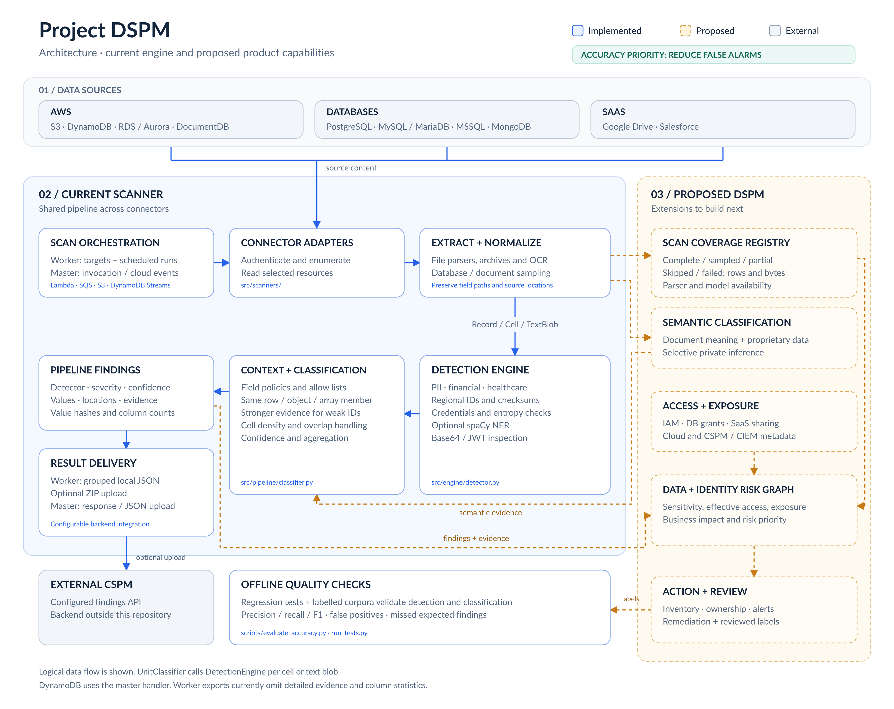
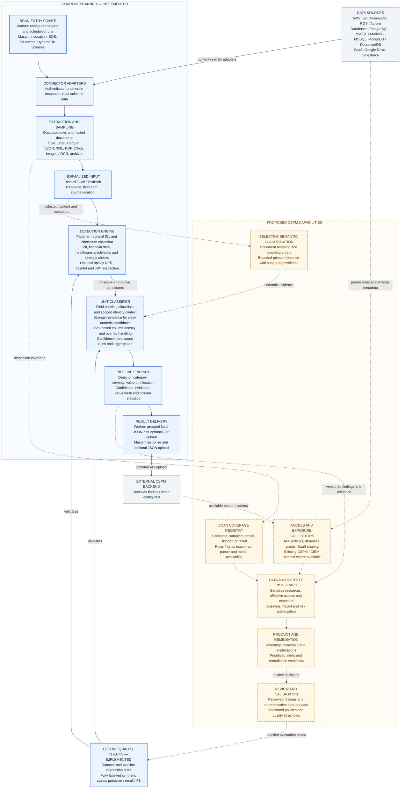

DSPM architecture: current implementation and proposed extensions.

Download the [PNG diagram](architecture.png) or [editable SVG](architecture.svg). The detailed Mermaid source and code map follow below.

Blue components are implemented in this repository. Grey components are external systems. Orange components and dotted connections represent proposed work. Arrows show logical data flow; `UnitClassifier` calls `DetectionEngine` for each cell or text blob during execution.

The current accuracy priority is reducing false alarms. Identity context is scoped to the same row or containing object, with array members kept separate. Weak numeric candidates require stronger evidence before promotion.

The current engine follows these boundaries in code:

| Component | Implementation |
|---|---|
| Scan entry points | [Worker](../src/dspm_scanner_worker_handler.py), [master handler](../src/dspm_scanner_master_handler.py) |
| Connector contract | [BaseScanner](../src/scanners/base.py) and adapters under `src/scanners/` |
| Parsing and normalized input | [File parsers](../src/scanners/files/parsers.py), [Record / Cell / TextBlob](../src/pipeline/records.py) |
| Candidate detection | [DetectionEngine](../src/engine/detector.py), [layers](../src/engine/layers.py), [recognizers](../src/engine/recognizers/) |
| Context and statistical classification | [UnitClassifier](../src/pipeline/classifier.py), [column profiles](../src/pipeline/columns.py), [sampling](../src/pipeline/sampling.py) |
| Accuracy checks | [Test runner](../run_tests.py), [labelled-case evaluator](../scripts/evaluate_accuracy.py) |

DynamoDB scans are currently exposed through the master handler. The worker groups results before export and currently omits pipeline evidence and column statistics from that grouped output. Preserving those fields requires the proposed versioned findings contract. Coverage and risk nodes describe future components; the current sampling stop rule does not establish that unread data is clean.

The proposed components and their priorities are explained in the [competitive assessment](dspm-competitive-assessment.md).
