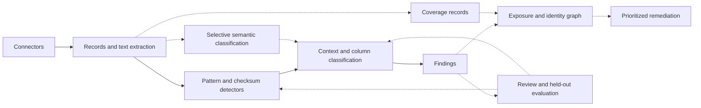

DSPM competitive assessment and accuracy review, 13 September 2026.

The selected accuracy priority is reducing false alarms. A subsequent [context-policy improvement pass](false-alarm-reduction.md) tightens weak-match promotions and records its own before/after results; the measurements below describe the initial improvement pass.

The repository has a working discovery and classification foundation: multiple connectors, shared parsing, regional validators, credential detection, optional spaCy NER, and column/record policies. The next competitive step is to make its results measurable, explainable and connected to actual data exposure. Adding more regex patterns alone will not supply document meaning, effective access analysis or proof of scanning coverage.

This review uses public vendor documentation and technical articles, together with local code and tests. Public descriptions reveal useful design choices, but do not disclose complete proprietary implementations. No commercial engines were run against this project's corpus, and no direct accuracy ranking is justified by these sources.

| Provider | Publicly described approach | Useful engineering lesson for this project |
|---|---|---|
| Cyera | Combines clustering, semantic similarity, LLM verification of pattern matches, semantic document classification and learned classification of proprietary data. Its December 2025 article describes these as components of a broader system. [Cyera technical explanation](https://www.cyera.com/blog/understanding-data-in-context-an-llm-driven-approach-to-data-classification). | Keep deterministic detection for well-defined identifiers; add document context and a selective semantic verification stage for ambiguous or proprietary content. |
| Wiz | Describes built-in, custom and learned classifiers, metadata analysis, representative sampling, and full-content inspection for mixed/unstructured files. Its May 2025 article described Novel Classifiers as being in preview at that time. [Wiz classification architecture](https://www.wiz.io/blog/wiz-data-classification). | Choose inspection depth by data shape and measured coverage. Preserve multiple supported data types in mixed content. |
| Wiz, recent engineering detail | An August 2026 article describes staged AI analysis, grouping similar files, deterministic processing outside the AI stage, structured findings, synthetic-data verification and ground-truth feedback. Findings feed the Security Graph. [Wiz context engine](https://www.wiz.io/blog/bucket-scanner-to-context-engine). | Build a review and evaluation loop; measure cost and quality for each stage. Connect classification with exposure and identity evidence. |
| Orca | SideScanning combines workload inspection with statistical analysis of sensitive-data patterns. Its custom detection feature exposes regex rules, column/file allow and deny lists, count/density thresholds, and detection logic. [SideScanning technical brief](https://orca.security/wp-content/uploads/Orca-Security-SideScanning-Technical-Brief.pdf), [custom detection](https://orca.security/resources/blog/custom-data-detection/). | Offer inspectable evidence and tenant-specific policies. Density must count the actual sampled units correctly. |
| Amazon Macie | Managed identifiers use type-specific keyword rules. Context can come from the same cell, a column name, a JSON path, or nearby text, depending on the input format. [Keyword requirements](https://docs.aws.amazon.com/macie/latest/user/managed-data-identifiers-keywords.html). | Preserve structural context through every parser; do not flatten a whole document into one undifferentiated string. |
| Google Sensitive Data Protection | Supports exclusion, hotword and likelihood-adjustment rules, including column-header context. [Inspection rules](https://docs.cloud.google.com/sensitive-data-protection/docs/creating-custom-infotypes-rules). | Make positive and negative evidence configurable, and keep detector confidence distinct from business risk. |

Cyera currently publishes a 95%+ precision claim, while another product page reports a customer-specific 98% precision result. Those figures have different scopes and do not provide a shared held-out dataset, detector taxonomy or recall measurement for this repository. Treat them as vendor claims, not as an engineering acceptance test. [Cyera DSPM](https://www.cyera.com/platform/dspm), [enriched classification](https://www.cyera.com/platform/enriched-classification).

The local review found the following concrete issues. The implemented fixes apply through the shared pipeline, so every connector using it benefits.

| Reproduced issue | Previous behavior | Implemented behavior |
|---|---|---|
| Occurrences counted as column density | Three weak SSN-shaped values in one of six cells became a 50% match and were reported as likely. Multiple validated matches in a cell could also inflate validation density. | Each cell contributes once to match density, validation density and the majority tier. Occurrences remain separately countable. |
| Blanket column exclusivity | A notes column with five emails and five explicitly supported phone numbers reported only emails. A rare, explicitly labelled SSN in an email-heavy column disappeared. | Independently supported findings outside the dominant detector's spans survive. Weak competing interpretations still face the existing suppression policy. |
| Encoded overlap resolution | Two different emails decoded from a single base64 payload shared its outer coordinates; the second was discarded as a duplicate. | Distinct decoded values survive. Tests also cover multiple JWT email claims and different data types in one encoded cell. |
| Reused finalization state | Calling `finish()` changed stored finding confidence/evidence, allowing stale column promotions to persist after more records arrived. | Finalization works on copies; observations retain their original evidence. |
| Inconsistent adaptive ratio | Detectors requiring validated density were checked for sampling stability using raw match density. | Sampling stability uses the same validated-cell numerator as the column verdict. The stop rule remains a heuristic. |

Code changes are in [detector.py](../src/engine/detector.py), [columns.py](../src/pipeline/columns.py) and [classifier.py](../src/pipeline/classifier.py). Aggregated pipeline findings now distinguish `occurrences`, `column_matches` and `column_validated_matches`, with a common sampled-cell denominator. Recognized formats count as validation evidence; this does not establish that a number belongs to a real person or that a credential is live.

The new [evaluation tool](../scripts/evaluate_accuracy.py) compares all expected and returned findings using detector, exact value and cell/blob location. It counts unexpected findings even on positive examples, disables aggregation so it cannot hide misses, reports per-detector metrics, and writes reports without detected values. It measures these locations, not character-level boundary accuracy. The existing corpus remains useful for historical regressions, but its selected expected/forbidden labels do not fully measure all false detections.

Measured on the same [14 fully labelled synthetic cases](../tests/fixtures/accuracy_cases.json):

| Measure | Before the classification fixes | After |
|---|---:|---:|
| Correct findings | 28 | 35 |
| Unexpected findings | 3 | 0 |
| Missed findings | 7 | 0 |
| Precision | 90.32% | 100% |
| Recall | 80.00% | 100% |
| F1 | 84.85% | 100% |
| Completely correct cases | 10/14 | 14/14 |

The baseline was measured against the starting classification implementation at commit `0d21a7b`; reports are saved as [before](benchmarks/accuracy-before.json) and [after](benchmarks/accuracy-after.json). These cases were developed to reproduce the issues and guide the fixes. They are not an independent holdout, do not measure NER quality (`ner=false`), and do not establish 100% accuracy on customer data. The full suite was also run with NER explicitly enabled to exercise the models and historical corpus.

Validation completed with **326 tests passing, zero failing, no model tests skipped** using `NER_ENABLED=true .dspmenv/bin/python run_tests.py`. The local `.env` disables NER, so an ordinary run silently counted four skipped model tests as passes; the explicit environment override exercised them without changing that configuration. Seven tests were added for the new regressions and evaluator behavior. The initial suite had one unrelated test-isolation failure: an already-consumed `ExitStack` restored local settings before a second worker scenario. A fresh isolation stack now keeps that scenario local and makes its error assertion deterministic.

The next work should follow this order. These are recommendations from the code review, not features completed in this pass.

1. **Build a representative evaluation set and review loop.** Collect consented, reviewed examples covering both sensitive and ordinary data from each target source. Label all supported entities, not just the one that first raised an alert. Include IDs versus order numbers, realistic test fixtures, multiple countries, malformed values, mixed notes, nested arrays, OCR errors and rare positives. Split by customer/source/template before tuning so copies of the same export do not leak into evaluation. Track precision, recall and F1 by detector, connector, language and structured/unstructured shape; report the sample counts and uncertainty. Separately measure false alerts per thousand clean cells and the proportion of sensitive resources discovered. Choose release thresholds using the cost of a false alert versus a missed identifier for each class.

2. **Make incomplete inspection visible.** The parser currently skips malformed CSV lines, caps plain-text scanning at 8 MB and long lines at 200,000 characters, and truncates NER input at 50,000 characters. Object-size limits and unsupported binary formats create other gaps. Some scanner errors are already recorded, but the product needs one coverage record per resource: complete, sampled, partial, skipped or failed; rows/bytes examined; sampling method; parser/model availability; and a reason for any gap. An empty findings list must not imply that unread or unparsed content is clean. Inspect [parsers.py](../src/scanners/files/parsers.py), [ner.py](../src/engine/ner.py) and [BaseScanner](../src/scanners/base.py) when implementing this contract.

3. **Improve sampling without implying full coverage.** The default database strategy reads the head. PostgreSQL/MSSQL page samples and MongoDB sampling are useful options, but the present stability rule cannot establish a recall guarantee. Stratify by partition/time range/schema and retain a discovery budget for rare types. Under an independent uniform sampling assumption and perfect detection of encountered positives, the chance of seeing at least one positive is `1 - (1 - p)^n`; at prevalence 0.1%, about 2,995 rows are needed for 95%. Head samples do not satisfy that assumption. Measure extraction and sampling misses separately from classifier misses.

4. **Calibrate context and add semantic classification selectively.** The current numeric scores and tier promotions are hand-written evidence rules, not calibrated probabilities. Record which signals produced each verdict and fit thresholds against held-out labels. Evaluate ambiguity across countries and false corroboration from generic sibling names. Add a private document-classification stage for contracts, medical narratives, source code and proprietary documents; give it metadata, bounded representative content and a constrained output schema with supporting evidence. Route uncertain cases to review. Keep checksums and format validation deterministic. Deploy a semantic stage only after it improves the held-out precision/recall tradeoff at an acceptable latency and cost.

5. **Connect sensitivity to effective access and exposure.** Classification confidence answers whether a finding is correct; sensitivity describes its impact; risk also depends on exposure and access. Build resource/identity relationships from cloud policies, database grants and SaaS sharing, then associate sensitive findings with reachable resources. Join existing CSPM/CIEM information where available. Prioritize findings such as sensitive customer records reachable through an overly broad role or public link. Add an owner and a concrete remediation workflow. Keep this risk score separate from classifier confidence.

6. **Preserve evidence into the product and constrain runtime cost.** The pipeline produces useful evidence and fingerprints, but the worker's [club_findings](../src/dspm_scanner_worker_handler.py) retains only grouped values, locations, counts and maximum confidence. Version the backend schema to retain explanations, coverage, detector/model versions and review decisions. Introduce tenant-scoped policies and value exclusions with an audit trail. Measure bytes/rows per second, peak memory and cost per scanned GB; the current classifier retains every candidate in memory, and the new source coordinates add per-match metadata. Add bounded evidence retention and incremental rescans before targeting very large exports.

A proposed architecture builds on the existing separation of connectors, parsing, detection and unit classification. The dotted branches below are subsequent product work.

A practical initial product focus is the sources already supported well here: AWS storage plus PostgreSQL/MongoDB and a deliberately tested set of regional identifiers. Validate that scope with design partners, publish reproducible quality and coverage results, and expand connectors according to observed customer demand. That gives the engine a credible basis for competing on trust, deployment fit and explainability while semantic and access-risk capabilities grow.
